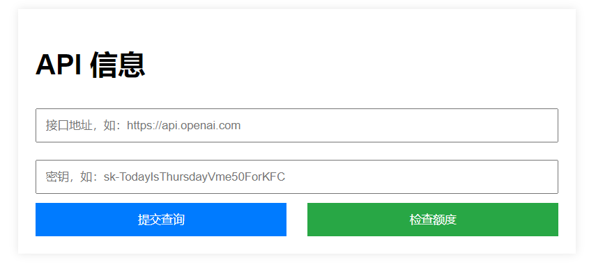
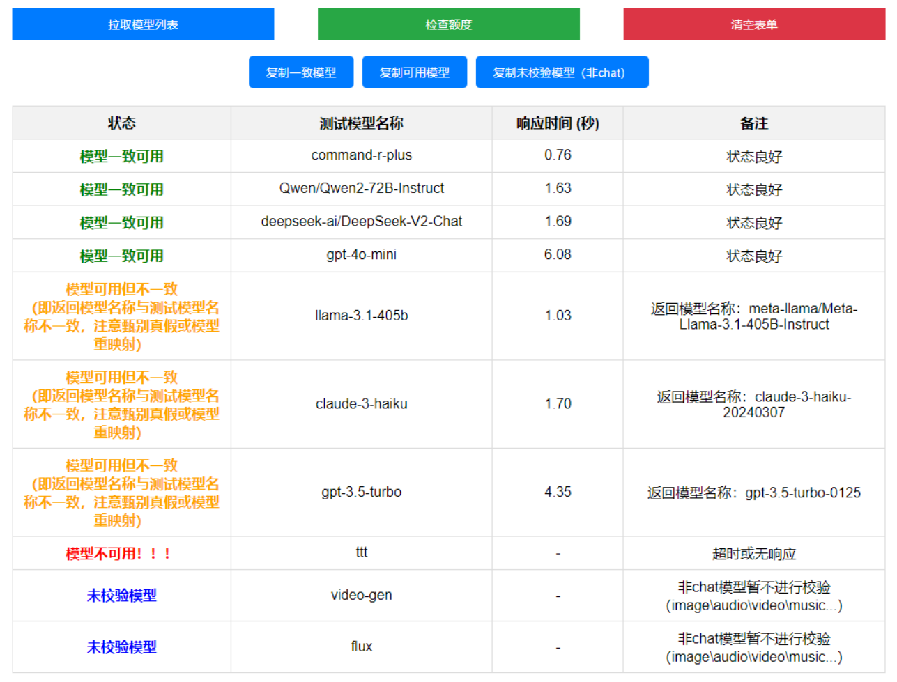

朴实无华的查询界面，仅支持以one-api/new-api/... 等 OpenAI 标准格式的 api 测活，本代码由 GPT 辅助完成

- 本地运行

    - 安装环境

    ```
    pip install -r requirements.txt
    ```

    - 执行代码

    ```
    python app.py
    ```

    - 打开浏览器：http://localhost:5000

- serverless 部署
    - vercel
    - zeabur: 需要添加环境变量 ZBPACK_SERVERLESS 和 PORT



-----

* 新增feature：模型可用性检测



-----

受Serverless版网关限制，本项目发展有限（本地部署运行依旧正常），现转向全新纯前端版本：https://github.com/QAbot-zh/query-key